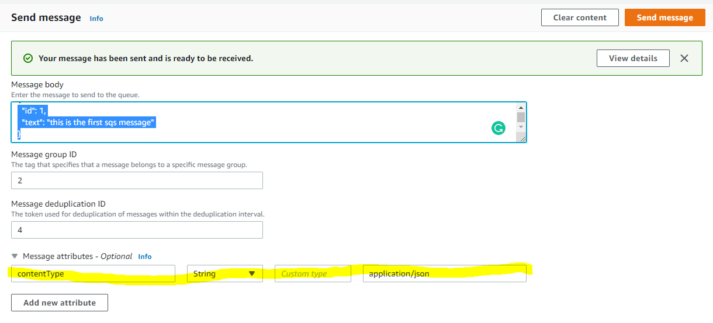

## Setting up SQS Service With Spring Cloud AWS

### POM Dependencies
You will need the following dependencies:

**Spring Boot Parent (or manually imported spring deps)**
```xml
    <parent>
        <groupId>org.springframework.boot</groupId>
        <artifactId>spring-boot-starter-parent</artifactId>
        <version>2.6.7</version>
        <relativePath/> <!-- lookup parent from repository -->
    </parent>
```

**AWS Spring Cloud**
```xml
        <dependency>
            <groupId>io.awspring.cloud</groupId>
            <artifactId>spring-cloud-aws-dependencies</artifactId>
            <version>2.3.0</version>
            <type>pom</type>
            <scope>import</scope>
        </dependency>
        <dependency>
            <groupId>io.awspring.cloud</groupId>
            <artifactId>spring-cloud-starter-aws-messaging</artifactId>
            <version>2.3.0</version>
        </dependency>
```

**Notes:**
You will also need _jackson_ on the classpath as this will be used for serialization/deserialization. This should be pulled in with your parent starter pom, or other spring dependencies.


### Amazon SQS Configuration

In `application.properties` set these properties:
```properties
cloud.aws.credentials.accessKey=AKTHEREMAYBEADIFFERENTACCESSKEY
cloud.aws.credentials.secretKey=YOUR_ROLE_OR_USER_SECRET_KEY
cloud.aws.region.static=us-east-1
```

There is also another way for your app to assume an AWS role without these keys in kubernetes.

A specific company uses a file in this folder `aws/auth-consumer-role.yaml`, which should allow the application to assume a given role without manually entering the above properties.

### Class Structure - SQSMessageReceiver.java 
`SQSMessageReceiver.java` in this project has a component annotationm, so it is loaded at spring runtime.

Within this spring bean there is a method annotated `@SQSListener` that takes two attributes in the annotation:

| Attribute Name | Example Value | Description |
| -------------- | ------------- | ------------|
| value          | https://sqs.us-east-1.amazonaws.com/675152124436/DemoQueue.fifo | HTTP Endpoint of your AWS SQS Queue |
| deletionPolicy | SqsMessageDeletionPolicy.ON_SUCCESS | The deletion policy for messages in the queue |


**Queue's Deletion Policy:**

This attribute specifies when you actually want to delete messages from your queue.

i.e.
SqsMessageDeletionPolicy.ON_SUCCESS will delete the message from the AWS SQS queue iff your @SQSListener method doesn't throw any exceptions.

Other deletion policies can be used and implemented, i.e. ALWAYS delete, or you can stick failed messaged onto a deadletter queue.

Read about the available [deletion policies](https://javadoc.io/doc/org.springframework.cloud/spring-cloud-aws-messaging/2.1.3.RELEASE/org/springframework/cloud/aws/messaging/listener/SqsMessageDeletionPolicy.html)


**SQSListener:**

Your spring cloud aws dependencies will automatically create a `queueMessageHandler` that will 
consumer and forward messages to your handler annotated with `SQSListener` with very minimal code

#### Listener Method Params
| Annotation Name |  Description |
| -------------- |  ------------|
| @Headers       | Will populate a map or a string with the headers of your SQS message |
| @Payload       | Jackson will automatically deserialize the payload or body of the message to the given pojo (Either based on attribute name or @JSONProperty annotation)|

**Note:** 

In the header (or attributes) of your SQS message you must set, 
`contentType = application/json` or you will receive a deserialization failure with no readily apparent clause.
```java
org.springframework.messaging.converter.MessageConversionException: Cannot convert from [java.lang.String] to [com.dustinkendall.awssqsconsumer.domain.MessagePojo] for GenericMessage
```



### In Action

Single Message using `receivePojo()` method:
```json
{
  "id": 1,
  "text": "this is the first sqs message"
}
```

Pojo Result:
```

  .   ____          _            __ _ _
 /\\ / ___'_ __ _ _(_)_ __  __ _ \ \ \ \
( ( )\___ | '_ | '_| | '_ \/ _` | \ \ \ \
 \\/  ___)| |_)| | | | | || (_| |  ) ) ) )
  '  |____| .__|_| |_|_| |_\__, | / / / /
 =========|_|==============|___/=/_/_/_/
 :: Spring Boot ::                (v2.6.7)

2022-05-13 01:37:05.379  INFO 6392 --- [           main] c.d.a.AwsSqsConsumerApplication          : Starting AwsSqsConsumerApplication using Java 11.0.10 on DESKTOP-ARAS332 with PID 6392 (C:\Users\dkend\Documents\Projects\java\aws-sqs-consumer\target\classes started by dkend in C:\Users\dkend\Documents\Projects\java\aws-sqs-consumer)
2022-05-13 01:37:05.382  INFO 6392 --- [           main] c.d.a.AwsSqsConsumerApplication          : No active profile set, falling back to 1 default profile: "default"
2022-05-13 01:37:06.926  WARN 6392 --- [           main] i.a.c.m.l.SimpleMessageListenerContainer : AmazonSQSBufferedAsyncClient that Spring Cloud AWS uses by default to communicate with SQS is not compatible with FIFO queues. Consider registering non-buffered AmazonSQSAsyncClient bean.
2022-05-13 01:37:06.973  INFO 6392 --- [           main] c.d.a.AwsSqsConsumerApplication          : Started AwsSqsConsumerApplication in 1.893 seconds (JVM running for 2.699)
The pojo was automatically deserialized by jackson/spring because 
contentType = application/json
MessagePojo{id=0, text='this is the first sqs message'}
```

Single Message using `receivePojoMap()`:
```json
{
  "dynamic_key":
  {
    "id": 1,
    "text": "this is the first sqs message"
  },
  "second_key":
  {
    "id": 2,
    "text": "this is the second sqs message"
  }
}
```
Map Result: 
```
  .   ____          _            __ _ _
 /\\ / ___'_ __ _ _(_)_ __  __ _ \ \ \ \
( ( )\___ | '_ | '_| | '_ \/ _` | \ \ \ \
 \\/  ___)| |_)| | | | | || (_| |  ) ) ) )
  '  |____| .__|_| |_|_| |_\__, | / / / /
 =========|_|==============|___/=/_/_/_/
 :: Spring Boot ::                (v2.6.7)

2022-05-13 01:31:34.276  INFO 11724 --- [           main] c.d.a.AwsSqsConsumerApplication          : Starting AwsSqsConsumerApplication using Java 11.0.10 on DESKTOP-ARAS332 with PID 11724 (C:\Users\dkend\Documents\Projects\java\aws-sqs-consumer\target\classes started by dkend in C:\Users\dkend\Documents\Projects\java\aws-sqs-consumer)
2022-05-13 01:31:34.279  INFO 11724 --- [           main] c.d.a.AwsSqsConsumerApplication          : No active profile set, falling back to 1 default profile: "default"
2022-05-13 01:31:35.776  WARN 11724 --- [           main] i.a.c.m.l.SimpleMessageListenerContainer : AmazonSQSBufferedAsyncClient that Spring Cloud AWS uses by default to communicate with SQS is not compatible with FIFO queues. Consider registering non-buffered AmazonSQSAsyncClient bean.
2022-05-13 01:31:35.823  INFO 11724 --- [           main] c.d.a.AwsSqsConsumerApplication          : Started AwsSqsConsumerApplication in 1.859 seconds (JVM running for 2.747)
Entry Key = dynamic_key
Entry Value = MessagePojo{id=0, text='this is the first sqs message'}
Entry Key = second_key
Entry Value = MessagePojo{id=0, text='this is the second sqs message'}

```

### Fifo Configuration (needed for FIFO queues)

You will receive this message upon the default SQSListner configuration.

```java
2022-05-13 01:37:06.926  WARN 6392 --- [           main] i.a.c.m.l.SimpleMessageListenerContainer : AmazonSQSBufferedAsyncClient that Spring Cloud AWS uses by default to communicate with SQS is not compatible with FIFO queues. Consider registering non-buffered AmazonSQSAsyncClient bean.
```

To avoid you will need to set up using a few different configurations. See 
[FIFO Setup Documentation](https://docs.awspring.io/spring-cloud-aws/docs/2.4.0/reference/html/index.html#fifo-queue-support) for more information.

;TLDR

Adding SQSListenerConfig.java - (see class)
Removes the above message.

```
  .   ____          _            __ _ _
 /\\ / ___'_ __ _ _(_)_ __  __ _ \ \ \ \
( ( )\___ | '_ | '_| | '_ \/ _` | \ \ \ \
 \\/  ___)| |_)| | | | | || (_| |  ) ) ) )
  '  |____| .__|_| |_|_| |_\__, | / / / /
 =========|_|==============|___/=/_/_/_/
 :: Spring Boot ::                (v2.6.7)

2022-05-13 01:55:23.059  INFO 21648 --- [           main] c.d.a.AwsSqsConsumerApplication          : Starting AwsSqsConsumerApplication using Java 11.0.10 on DESKTOP-ARAS332 with PID 21648 (C:\Users\dkend\Documents\Projects\java\aws-sqs-consumer\target\classes started by dkend in C:\Users\dkend\Documents\Projects\java\aws-sqs-consumer)
2022-05-13 01:55:23.063  INFO 21648 --- [           main] c.d.a.AwsSqsConsumerApplication          : No active profile set, falling back to 1 default profile: "default"
2022-05-13 01:55:24.771  INFO 21648 --- [           main] c.d.a.AwsSqsConsumerApplication          : Started AwsSqsConsumerApplication in 2.027 seconds (JVM running for 2.846)
The pojo was automatically deserialized by jackson/spring because 
contentType = application/json
MessagePojo{id=0, text='this is the first sqs message'}

```


